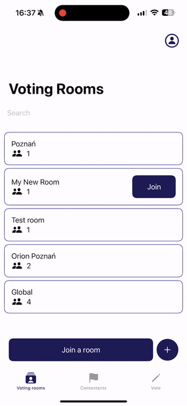
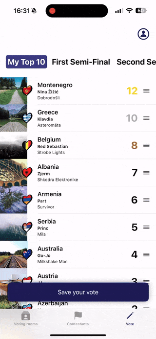
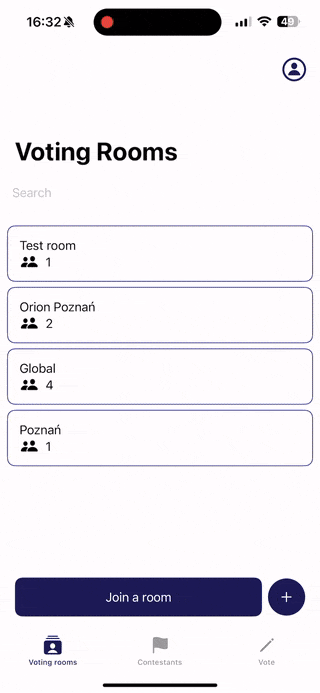

# MyESCParty - Real-time Eurovision Voting Experience

**MyESCParty** is a multi-user iOS app that recreates the Eurovision voting experience in private groups - allowing users to vote, rank performances, and see live results together.

It transforms traditional, manual score tracking into a **real-time, interactive social experience**.

---

## 🚀 Why I built this

Watching Eurovision with friends often involves:
- manual spreadsheets  
- inconsistent scoring  
- delayed results  

👉 I wanted to design a system that enables **synchronized, real-time voting across multiple users**, while keeping the experience simple and engaging.

---

## ✨ Key Features

- 👥 **Private & public voting rooms**  
  Users can create or join rooms to vote together in groups  

- 🗳️ **Drag-and-drop voting system**  
  Intuitive ranking mechanism mapped to Eurovision scoring (12–1 points)  

- 🔄 **Real-time vote synchronization**  
  Votes are shared across participants using Supabase  

- 📊 **Results per room & global results**  
  Compare group preferences with overall trends  

- 👤 **User authentication & profiles**  
  Secure login and personalized experience
  
---

## 🎥 Demo

### Creating and joining rooms


### Drag-and-drop voting system


### Viewing results


> 📌 Note: GIFs recorded from simulator.

---

## 🧠 Technical Highlights

### Architecture
- MVVM with clear separation of concerns  
- Scalable structure for features like rooms, voting stages, and user management  

### State Management
- SwiftUI-driven reactive UI (`@StateObject`, `@EnvironmentObject`)  
- Clean data flow between views and business logic  

### Backend & Data
- Supabase (PostgreSQL + Auth)  
- PostgREST API integration  
- Designed for **multi-user data consistency**  

### Real-time Communication
- Synchronization of votes across users  
- Foundation prepared for live updates and reactive results  

---

## 🧩 Challenges & Solutions

**Synchronizing votes across multiple users**  
→ Designed a room-based data model with shared state to ensure consistency between participants  

**Mapping Eurovision scoring into intuitive UX**  
→ Implemented drag-and-drop ranking that directly translates into the 12–1 scoring system  

**Maintaining clean architecture with growing features**  
→ Separated concerns into ViewModels and Services to keep the codebase maintainable  

---

## 🛠 Tech Stack

- Swift  
- SwiftUI  
- Supabase (PostgreSQL, Auth)  
- PostgREST  
- SwiftUIIntrospect  
---

## 📱 Requirements

- iOS 17.6+
- Xcode 15+

## 🚀 Installation

1. Clone the repository:
   ```bash
   git clone https://github.com/mpiechota92/MyESCParty.git
   ```
2. Open the project in Xcode and build the app.
3. On your iOS device, enable "Demo Mode" for the app in system settings.
4. Log in with any valid credentials (must match field types), e.g.  
   **Email:** `test@test.com`  
   **Password:** `123456789`

---

## 📌 To Do / Roadmap

- [x] User profile editing
- [x] Voting animations
- [x] Live voting results with auto-refresh
- [ ] QR code invitations for private rooms
